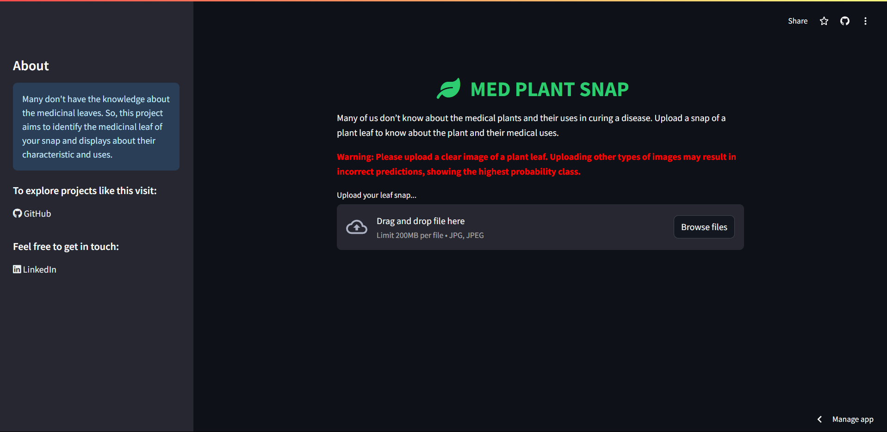

# Med Plant Snap 🌿

Med Plant Snap is a [Streamlit web application](https://med-plant-snap.streamlit.app/) designed to help users identify medicinal plants from leaf images. By uploading a leaf image, users can learn about the plant's scientific name, diseases it treats, preparation methods, and administration details. The app leverages a pre-trained TensorFlow model for plant classification and provides an easy-to-use interface with custom styling.



## Table of Contents
- [Features](#features)
- [Installation](#installation)
- [Usage](#usage)
- [Customization](#customization)

## Features
- **Upload Leaf Image:** Users can upload an image of a leaf to identify the medicinal plant.
- **Plant Information:** The app provides the plant's scientific name, diseases it treats, preparation methods, and administration instructions.
- **Real-Time Feedback:** The app predicts and displays the plant information quickly and efficiently.
- **User-Friendly Interface:** The interface is designed with custom styling for an engaging user experience.
- **Warnings:** The app includes warnings to encourage users to upload proper leaf images for accurate predictions.

## Installation

### 1. Clone the Repository
```bash
git clone https://github.com/yourusername/med-plant-snap.git
cd med-plant-snap
```

### 2. Create and Activate a Virtual Environment (Optional but Recommended)
```bash
python -m venv env
source env/bin/activate  # On Windows use `env\Scripts\activate`
```

### 3. Install the Required Dependencies
```bash
pip install -r requirements.txt
```

## Usage

### 1. Start the Streamlit Application
```bash
streamlit run app.py
```

### 2. Access the Application
Once the server starts, you can access the app in your web browser at:
```
http://localhost:8501
```

### 3. Upload and Predict
- **Upload a Leaf Image:** Use the file uploader to select a leaf image (in .jpg format).
- **Predict Plant Information:** After uploading the image, the app will process it and display the plant's details, including its scientific name, uses, and more.

## Customization

### Modify Plant Information
The app uses a CSV file (`details.csv`) containing plant information. You can modify this file to add or update plant details. Ensure that the plant class names in the CSV file match those used in the model.

### Model and Image Preprocessing
The model is loaded from the `MED_PLANT_SNAP(16.08.2024).h5` file, and image preprocessing is done using the PIL library. You can replace the model with a custom one by updating the model path and adjusting the preprocessing steps if necessary.
